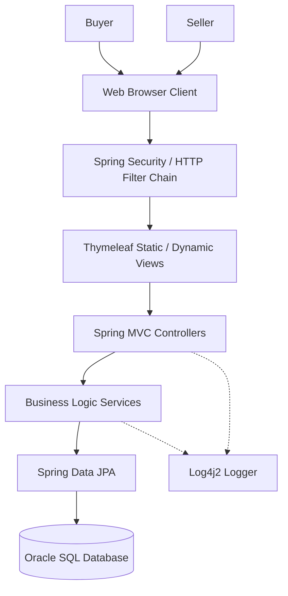

# RevShop Application Architecture

```mermaid
graph TD
  Client[Web Browser Client] --> Security[Spring Security / HTTP Filter Chain]
  Security --> UI[Thymeleaf Static / Dynamic Views]
  UI --> Controller[Spring MVC Controllers]
  Controller --> Service[Business Logic Services]
  Service --> Repository[Spring Data JPA]
  Repository --> DB[(Oracle SQL Database)]
  
  %% Cross-Cutting Features
  Controller -.-> Log[Log4j2 Logger]
  Service -.-> Log
  
  %% System Actors
  Buyer --> Client
  Seller --> Client
```
