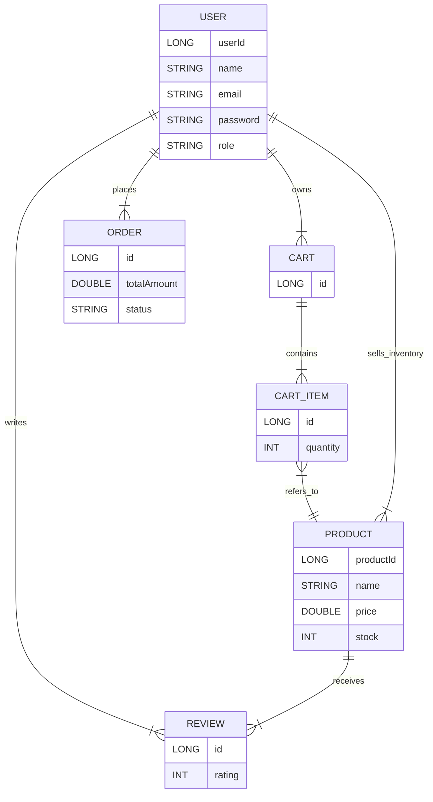

# RevShop Entity Relationship Diagram (ERD)

```mermaid
erDiagram
  USER {
    LONG userId
    STRING name
    STRING email
    STRING password
    STRING role
  }
  PRODUCT {
    LONG productId
    STRING name
    DOUBLE price
    INT stock
  }
  CART {
    LONG id
  }
  CART_ITEM {
    LONG id
    INT quantity
  }
  ORDER {
    LONG id
    DOUBLE totalAmount
    STRING status
  }
  REVIEW {
    LONG id
    INT rating
  }
  
  USER ||--|{ CART : owns
  CART ||--|{ CART_ITEM : contains
  CART_ITEM }|--|| PRODUCT : refers_to
  USER ||--|{ PRODUCT : sells_inventory
  USER ||--|{ ORDER : places
  USER ||--|{ REVIEW : writes
  PRODUCT ||--|{ REVIEW : receives
```
